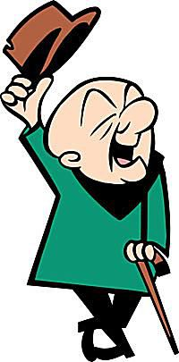

<h1>IT IS WORKING!</h1>

 

Welcome to my website! Hope everything works well!Click
<a href="Root_Directory_Folder/Main_Screen" target="_self"> here </a>
to get to the News Hub

 

Click on this link to get to the<a href="Image_Gallery/All_pics.html" target="_self"> Image gallery</a>

Click on this <a href="Superhero_Table/Table_Assignment.html" target="_self">link</a> to get to the Superhero Comparison Table

Wanna do math for no reason? Click <a href="Math_Page/Fake_Math_Test.html" target="_self">here!</a>

This website is supporting a YouTube content creator! Click on the following link to see a page related to his videos!<a href="MC_Page/Vid_List.html" target="_self">See Dark Swipez!</a>

Wanna see the colors I'm going to try to put on the website? Look here to see a preview and exactly which ones I'm using! <a href="Color_Scheme_Assignment/Color-table.html" target="_self">Color Scheme</a>

And this is a FAKE restaurant! Wanna see what we're not gonna serve? Click on the picture of the restaurant to see the menu!

Ever had a busy day? Me too! I made a table to show one of my most recent crazy days! This is the link to it: <a href="/Schedule/Schedule-Table.html">Crazy Day Schedule</a>

